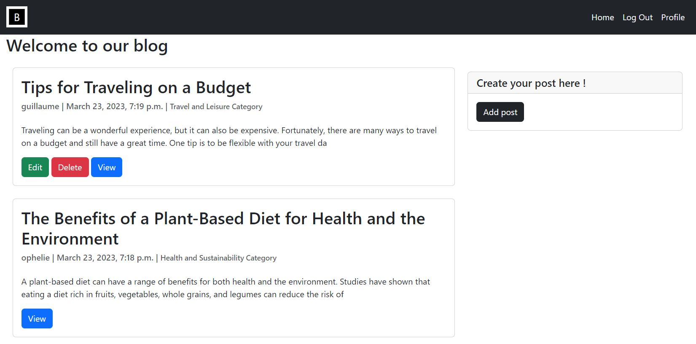

<body>
  <h1>Basic Blog Application</h1>
  

  
The Basic Blog Application is a simple blog website that allows users to create, view, edit, and delete blog posts. Users can also add categories to their posts and search for blog posts.

  <h2>Technologies</h2>
  <ul>
    <li>Python</li>
    <li>Django</li>
    <li>HTML5</li>
    <li>CSS3</li>
    <li>SQLite3 (default database)</li>
  </ul>
  <h2>Functional Requirements</h2>
  <ul>
    <li>User Registration: Users should be able to register for an account by providing their email, username, and password.</li>
    <li>User Authentication: Users should be able to log in and log out of their account.</li>
    <li>Create Blog Posts: Users should be able to create new blog posts by providing a title, content, and category (optional).</li>
    <li>Edit Blog Posts: Users should be able to edit existing blog posts.</li>
    <li>Delete Blog Posts: Users should be able to delete their own blog posts.</li>
    <li>View Blog Posts: Users should be able to view a list of all blog posts and view the details of a specific blog post.</li>
  </ul>
  <h2>Database Schema</h2>
  
The Basic Blog Application will use the following database schema:

  <ul>
    <li>User: This model will be used to store user information such as username, email, and password.</li>
    <li>Post: This model will be used to store blog post information such as title, content, author (foreign key to User), category (optional), created date, and modified date.</li>
    <li>Category: This model will be used to store category information such as name and description.</li>
  </ul>
  <h2>Installation</h2>
  
Follow these steps to set up the Basic Blog Application on your local machine:

  <ol>
    <li>Clone the repository to your local machine.</li>
    <li>Install Python 3 and Django.</li>
    <li>Navigate to the project directory and run <code>python manage.py migrate</code> to create the database schema. </li>
    <li>Run <code>python manage.py runserver</code> to start the server. </li>
    <li>Open your web browser and navigate to <a href="http://127.0.0.1:8000/">http://127.0.0.1:8000/</a> to access the application. </li>
  </ol>
  <h2>Usage</h2>
  
To use the Basic Blog Application, follow these steps:

  <ol>
    <li>Register for an account by providing your email, username, and password.</li>
    <li>Log in to your account.</li>
    <li>Create a new blog post by providing a title, content, and category (optional).</li>
    <li>Edit an existing blog post by clicking on the edit button next to the post.</li>
    <li>Delete your own blog posts by clicking on the delete button next to the post.</li>
    <li>View a list of all blog posts by navigating to the home page.</li>
    <li>View the details of a specific blog post by clicking on the post title.</li>
  </ol>
  <h2>Contributing</h2>
  
Contributions to the Basic Blog Application are welcome! To contribute:

  <ol>
    <li>Fork the repository.</li>
    <li>Create a new branch for your changes.</li>
    <li>Make your changes and commit them with clear commit messages.</li>
    <li>Push your changes to your forked repository.</li>
    <li>Create a pull request to merge your changes into the main repository.</li>
  </ol>
  <h2>Credits</h2>
  
The Basic Blog Application was developed by Guillaume, Fred and Ophelie

  <h2>License</h2>
  
The Basic Blog Application is released under the MIT License.

</body>
</html>
